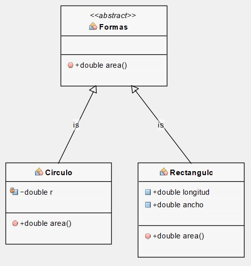

## Concepto

* Una ``clase concreta`` es una ``clase`` que tiene una ``implementación para todos sus métodos``

* ``No pueden tener`` ningún ``método no implementado``

* También puede ``extender`` una ``clase abstracta`` o ``implementar`` una ``interfaz`` siempre que ``implemente`` ``todos`` sus ``métodos``

* Es una ``clase completa`` y puede ser ``instanciada``

* Cualquier clase que no sea ``abstracta`` es una ``clase concreta``

* ``Condición`` necesaria para una ``clase concreta``

  * Debe haber una ``implementación`` para ``todos`` y cada uno de los ``métodos``

## Ejemplo

### Clase Concreta : Básica

```java
// Clase Concreta
class Suma {
  
    public static int producto(int a, int b)
    {
        return a * b;
    }
  
    public static int sum(int a, int b)
    {
        return a + b;
    }
  
    // main method
    public static void main(String args[])
    {
        int p = producto(5, 10);
        int s = suma(5, 10);
  
        System.out.println("Producto: " + p);
  
        System.out.println("Suma: " + s);
    }
}
```

### Clase Concreta : Usando una Clase Abstracta

```java
package rvs.ejemplo.clase.abstracta;

/**
 * Clase Abstracta
 * 
 * Contiene un método abstracto que sera heredado por las demás clases
 * descendientes
 * 
 * @author RVS
 *
 */
public abstract class Formas {

 /**
  * Metodo abstracto que sera heredado por las clases descendientes
  * 
  * @return - double - Devuelve el area de una forma concreta
  */
 public abstract double area();

}
```

* ``Clases Concretas Circulo y Rectángulo`` que heredan de la ``Clase Abstracta Formas``

* Clase Circulo

```java
import rvs.ejemplo.clase.abstracta.Formas;

/**
 * Clase Concreta : Circulo
 * 
 * @author RVS
 *
 */
public class Circulo extends Formas {

//  Atributo de instancia  
 private double r;

 /**
  * Metodo heredado de la Clase Abstracta
  * 
  * @return - double - Devuelve el area de un Circulo
  */
 @Override
 public double area() {
  return 3.14159265358979323846 * (r * r);
 }
}
```

<!-- Puedes explicarme con ejemplos de código cómo se utiliza el polimorfismo en Java , por favor -->

* Clase Rectángulo

```java
package rvs.ejemplo.clase.concreta;

import rvs.ejemplo.clase.abstracta.Formas;

/**
 * Clase Concreta : Rectangulo
 * 
 * @author RVS
 *
 */
public class Rectangulo extends Formas {

// Atributos de Instancia
 public double longitud;
 public double ancho;

 /**
  * Devuelve la longitud * por el ancho
  * 
  * @return - double - Devuelve el area de un Rectangulo
  */
 @Override
 public double area() {
  return longitud * ancho;
 }
}
```

### Diagrama UML

<<<<<<< HEAD
<<<<<<< HEAD
<!-- 



<figure>
  {{ fig_img | markdownify | remove: "<p>" | remove: "</p>" }}
  <figcaption>Photo from Unsplash.</figcaption>
</figure>
 -->

<!--  -->

<!--  -->


<!-- https://mmistakes.github.io/minimal-mistakes/assets/images/image-alignment-300x200.jpg -->



=======

>>>>>>> 5644fb0980788d183765341db5850b9c435aa5a3
=======

>>>>>>> 5644fb0980788d183765341db5850b9c435aa5a3
